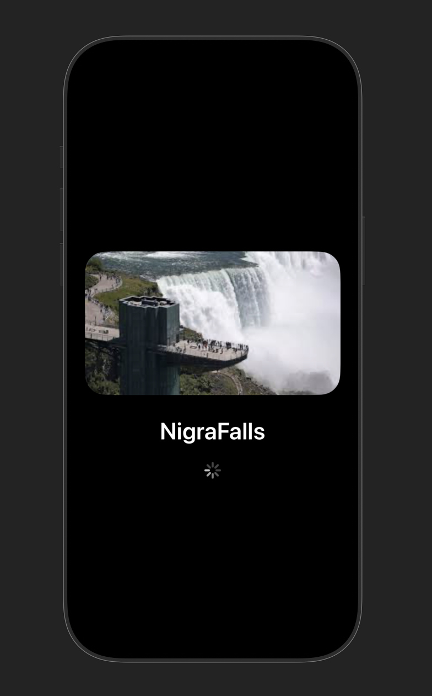

# niagrfalls

A minimal SwiftUI app that displays a full-screen splash screen with an image, title, and a loading spinner.

## Features

- Full-screen (ignoring safe areas) splash layout
- Centered content with image, title, and loader
- Dark background with white text/spinner for strong contrast
- Simple, single-view SwiftUI implementation

## Requirements

- Xcode 15 or later
- iOS 17 or later (adjust the deployment target as needed)
- Swift 5.9 or later

## Project Structure

- `niagrfallsApp.swift` — App entry point
- `ContentView.swift` — Splash screen view (image, title, loader)
- `Assets.xcassets` — Include `niagrafalls` image asset here
- `Screenshots/` — Folder containing README screenshots (add it if missing)

## Setup

1. Open the project in Xcode.
2. Add your splash image to Assets:
   - Name the image asset exactly: `niagrafalls`
   - Use a high-resolution image for best results.
3. Build and run on a simulator or device.

## Customization

- Change the background color:
  - In `ContentView`, modify `Color.black` to your preferred color.
- Update the title:
  - Edit the `Text("Nigra Falls")` string.
- Adjust image corner radius:
  - Modify `.cornerRadius(30)` on the image.
- Tweak spacing and layout:
  - Update the `VStack(spacing:)`, padding, or use `.scaledToFit()` as needed.
- Change loader appearance:
  - Adjust `.tint(.white)` and `.scaleEffect(1.2)` on `ProgressView()`.

## Optional: Auto-Transition After Delay

If you want the splash screen to transition to another view automatically:
- Create your destination view (e.g., `HomeView`).
- Add a state and a delay in `ContentView` or lift the state to a parent container.
- Navigate using a conditional or navigation stack. (Open an issue or request and we can wire this up for your exact target view.)

## Screenshots

Below is a screenshot from Xcode’s Canvas showing the splash screen:

## License

This project is provided as-is for educational/demo purposes. Use freely within your projects.
